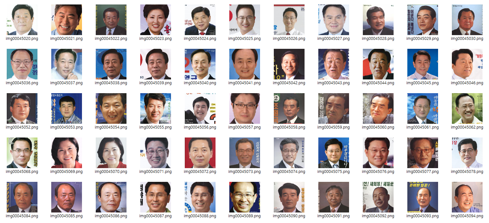
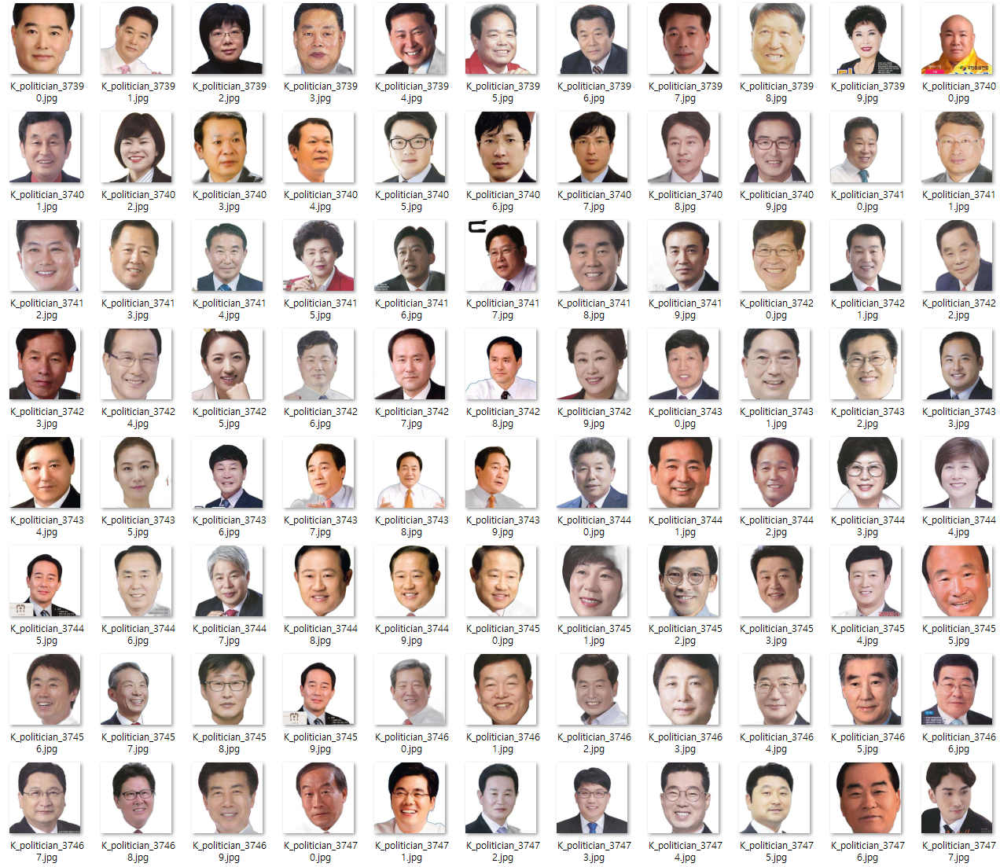
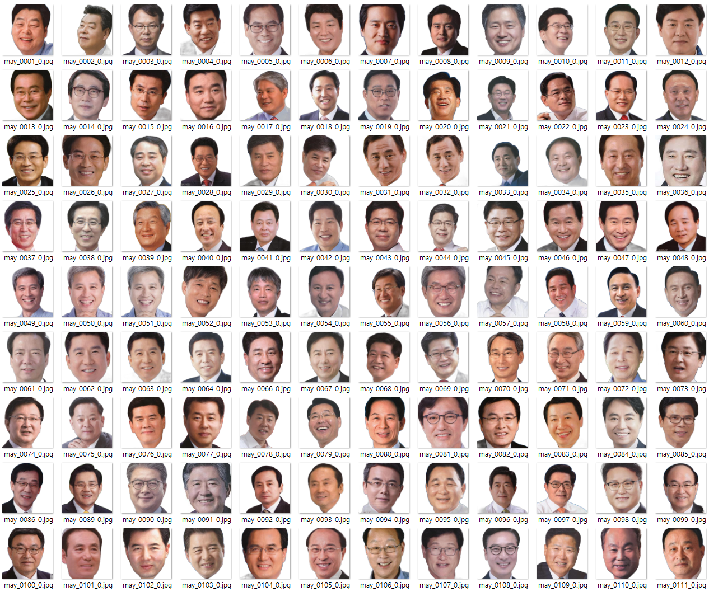
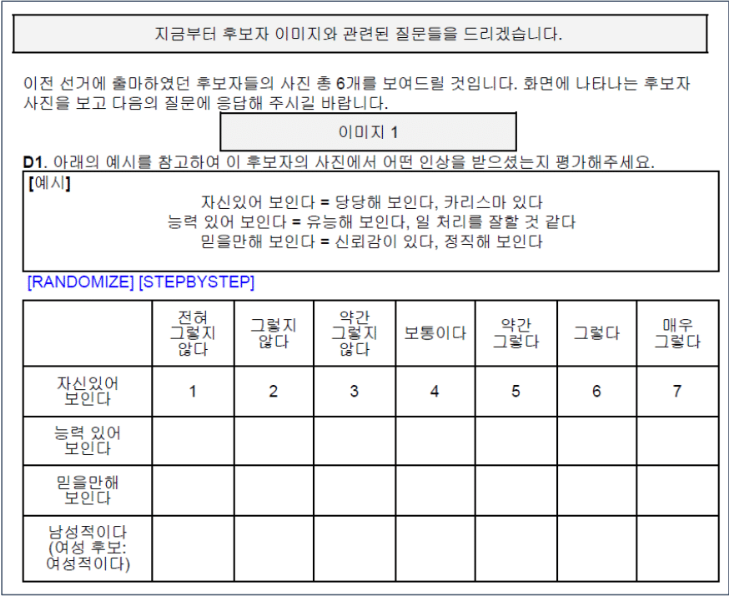

# PoliticGAN

## Introduction
Faces are rich sources of information – voters acquire political information from politicians’ faces. However, we do not know which and how politicians’ facial impressions influence voters’ political decision-making. 

**PoliticGAN** is a dataset of K-Politicians built with electoral poster images, annotated with evaluations for facial impressions (competence, dominance, trustworthiness, sex-typicality) via surveys conducted by a research team at Seoul National University ([Do Won Kim](https://github.com/DO-WON), [Center for Political Communication](http://cpc.snu.ac.kr/)). We have experimented on StyleGAN2-ADA, GANSpace, and StarGANv2 models to inspect which neural network will be appropriate for generating artificial images with interpretable dimensions of facial cues. This GAN experiment was designed by ([Haemin Song](https://github.com/0ohamnio0)).

Our final goal is to create a UI application with interpretable dimensions of facial cues, and we expect that researchers could use our generated images with specific target scores of facial cues in future experiments to analyze how specific facial cues influence voting behavior.

Our contributions are twofold. First, PoliticGAN adds racial diversity to existing face datasets, which were previously dominated by Caucasian faces. Second, we use transfer learning to overcome the problem of small datasets and augment our data. 

## Data Preparation
All poster images were downloaded from the Korean National Election Commission homepage. 
### Bulk Dataset for Pre-training

| image label        | [45,850] |
| :------------------|------|

**1. Run [autocrop](https://github.com/leblancfg/autocrop) to align faces, crop, and standardize images to 256x256 size**

**2. Run [backgroundremover](https://github.com/nadermx/backgroundremover) to remove other cues (partisan cues-number and color, texts, etc.)**

### Target Dataset for Main Traning

Considering the resolution and other quality traits of images, we restricted our data to the following recent elections: 2010, 2014, and 2018 South Korean local elections; and 2012, 2016, and 2020 South Korean legislative elections. We also chose images of candidates from two major parties: mainstream left and right.

| image label                                                                                                          | [5,572] |
| :--------------------------------------------------------------------------------------------------------------------|---------|
|Candidate No. 1 and No. 2 for the Provincial Councilor at Local Elections in 2010, 2014 and 2018                      | [3,222] |
|Candidate No. 1 and No. 2 for the Mayer at Local Elections in 2010, 2014 and 2018                                     | [1,048] |
|Candidate No. 1 and No. 2 for the Member of National Assembly at Legislative Elections in 2012, 2016, and 2020        | [1,306] |

- Run [autocrop](https://github.com/leblancfg/autocrop) and [backgroundremover](https://github.com/nadermx/backgroundremover) as well.
- We also manually removed any colors, numbers, or text that could be used to infer the competence or partisanship of candidates. 

### Survey procedure: Obtaining Scores of Inferred Traits of Candidates
- We collected scores on competency, dominance, trustworthiness, and masculinity/feminity inferred from candidate images. 
- Instructions are as follows: “Pictures of candidates who had previously run for elections will be shown. Please answer the questions about impressions from the candidates.” 
- Then, human raters will see the image of a candidate and answer whether they recognize the candidate. If they answer ‘Yes’, another candidate image will appear with the same question. If they answer ‘No’, the following instruction appears with 7-point Likert Scales: “Please rate what impressions you get from this candidate image." 

**Inter-coder reliability**: ICC(2,k) around 99% for each face-inferred trait.
We used an average of the ratings as the representative score for each facial trait. 

## Data Split and set domain with facial impression ratings 

**1. Set binary domain based on the survey result**

e.g. trust 1 if image's trust score is larger than the average score across respondents. 

| image label          | trust             |  binary           | 
| :------------------- | :----------------:| :----------------:|
| img  1               | 75.96             | 1                 |
| img  2               | 50.74             | 0                 |
| img  3               | 63.74             | 1                 |
| ...                  | ...               | ...               |

**2. Split data into total 8 domains**

|competence 0 | competence 1 | dominance 0 | dominance 1 | gendertyp 0 | gendertyp 1 | trust 0 | trust 1 |
|:----------- |:-----------  |:----------- |:----------- |:----------- |:----------- |:--------|:--------|

e.g. Competence = 1 

- **Training, Validation, and Testing**

| label | train | validation | test |
|:----------- |:-----------  |:----------- |:----------- |
|Ratio | 0.8 | 0.1 |0.1 |

## StyleGAN2-ADA
[[Original Code]](https://github.com/NVlabs/stylegan2-ada-pytorch)

**1k steps on a single RTX 3090 GPU with 45,850 images (bulk dataset)**

### Generated Images *(Virtual Politicians!)*

## GANSpace
[[Original Code]](https://github.com/harskish/ganspace)

We went latent space exploration with the above pre-trained StyleGAN2-ADA.

### IPA interpolation 

Problem: Since collected scores of facial impressions are subjective evaluations, rather than explicit traits such as gender or glasses, the results are highly subtle. How can we match these parameters with meaningful face features? In other words, how do we know that each controllable parameter indicates one of the important face-inferred traits (e.g. dominance)? 

## StarGAN v2
[[Original Code]](https://github.com/clovaai/stargan-v2)

StarGAN v2 is a type of unsupervised learning – the model generates style domains from the dataset without any labels. However, our goal is to use collected facial ratings as labels and generate images that reflect these labels. This was the recurring problem that we faced for most of the image generation tasks we tried. We thus take a detour – we first make subsamples of 5,572 images (binary classification using the mean value as the threshold; e.g. class 1: dominant, class 2: not dominant). Thus, each image now has binary parameters (dominant/competent/trustworthy/gender-typical or not). We then treat these classifications as domains, which are used to generate domain-specific style codes.

**Training from scratch: training on...(1) style code for each domain, (2) style transfer between domains**

**10k steps on a single RTX 3090 GPU with 5,572 images (target dataset)**

### interpolation *(competence 0 -> dominance 1)*

# Contributors
<!-- readme: contributors -start -->
<table>
<tr>
    <td align="center">
        <a href="https://github.com/DO-WON">
            
             
            <b>Do Won KIM</b>
        </a>
    </td>
    <td align="center">
        <a href="https://github.com/0ohamnio0">
            
             
            <b>Haemin Song</b>
        </a>
<!-- readme: contributors -end -->
