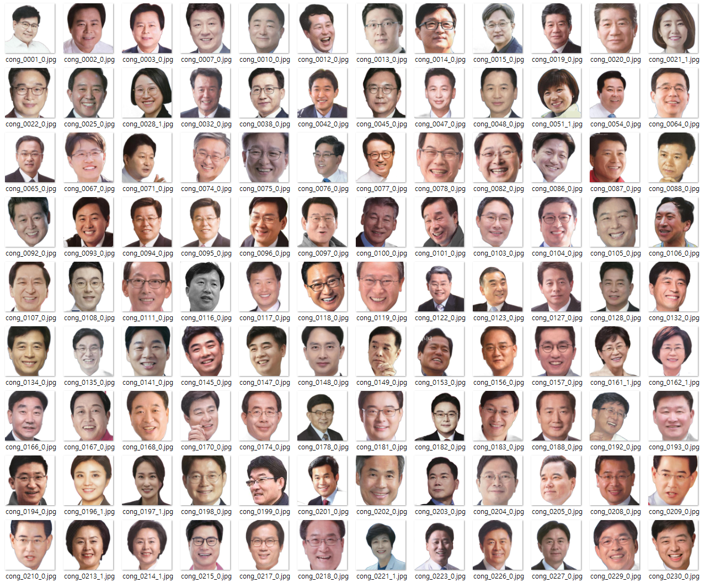

# PoliticGAN

## Introduction

**PoliticGAN** is a dataset of K-Politicians built with electoral posters from 1960 to 2020, provided by [Do Won Kim](https://github.com/DO-WON)([Center for Political Communication](http://cpc.snu.ac.kr/)). We experimented on StyleGAN2-ADA, GANSpace, and StarGANv2 models to inspect which neural network will be appropriate for finding facial properties that affect voters' political decision-making. Also, we find that there is lack of non-westernized facial dataset in piblic during data preparation, so this project might have significant help for who studies computer vision with multicultural values.

## Data Preparation

Candidate No. 1 and No. 2 for the Provincial Councilor at Provincial Election and Local Council Election between 2010 and 2021 [3,081]

Candidate No. 1 and 2 for the mayer of cities and counties at Provincial Election and Local Council Election in 2010, 2014 and 2018 [1,058]

Candidate No. 1 and 2 for he National Assembly in 2012, 2016, and 2020 [1,391]

[5,530개] 전처리

bulk img [45,850개] 전처리

설문조사 반영한 도메인 설정

## StyleGAN2-ADA
[[Original Code]](https://github.com/NVlabs/stylegan2-ada-pytorch)

## GANSpace
[[Original Code]](https://github.com/harskish/ganspace)

## StarGAN v2
[[Original Code]](https://github.com/clovaai/stargan-v2)

